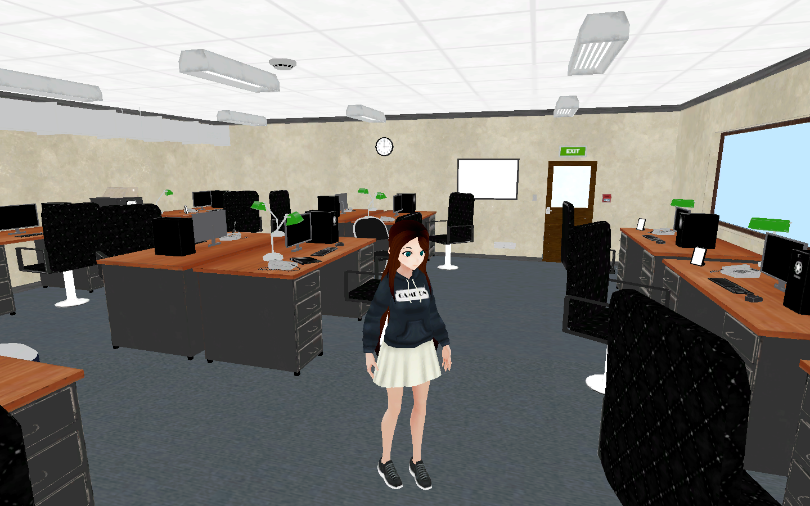

# Office Walkthrough FPS

A small first- and third-person walkthrough of a furnished office in **Unity 6** (6000.3.22f1, URP). The player can walk, run, jump, switch between first- and third-person view and open doors and cabinets.

**[Play it in your browser](https://vakuolga.github.io/office-walkthrough-fps/)** (WebGL build)

## Controls

| Key | Action |
|---|---|
| **W A S D** | Move |
| **Mouse** | Look around |
| **Shift** | Run |
| **Space** | Jump |
| **E** | Open / close the door or cabinet in front of you |
| **V** | Switch between first- and third-person view |
| **Mouse wheel** | Zoom the camera in and out (third person) |
| **Esc** | Release the cursor |
| **Left click** | Lock the cursor again |

## What I built

All code is in `Assets/Scripts/World/`.

- **`PlayerController.cs`**: a `CharacterController`-based player built on the new Input System.
  - First-person camera and a third-person orbit camera, switchable at runtime. In third person, movement is relative to the camera and the body only turns while moving.
  - Camera collision via `SphereCast`, so the third-person camera doesn't clip through walls; scroll-wheel zoom between a minimum and maximum distance.
  - Walking, running, jumping and gravity, driving the character's `Animator` (`Speed`, `Grounded`).
  - Interaction: `E` finds the nearest interactive object in front of the player with an overlap check and toggles it.
- **`HingedProp.cs`**: makes any door or cabinet leaf swing around one vertical edge of its mesh. The hinge side, opening angle and duration are set in the Inspector, so the same script works for every door in the scene.
- **`WorldMeshColliders.cs`**: the office prefabs ship without colliders, so this script adds a `MeshCollider` to every mesh under it at startup. The player can then stand on floors and is stopped by walls without setting up colliders by hand.

The scene `Assets/Scenes/OfficeShowcase.unity` combines these with the third-party packs below.

## Getting started

The easiest way to try it is the **[WebGL build](https://vakuolga.github.io/office-walkthrough-fps/)**: it runs in the browser, nothing to install.

This repository contains only my own code, the scene and the project settings. The 3D models, textures and animations come from free Unity Asset Store packs whose licence doesn't allow redistributing them:

1. **Office pack** by MarpaStudio: the office environment. It has since been deprecated on the Asset Store and can no longer be downloaded, so the scene can't be fully rebuilt from this repository. That is what the WebGL build is for.
2. **[Human Basic Motions FREE](https://assetstore.unity.com/packages/3d/animations/human-basic-motions-free-154271)** by Kevin Iglesias: animations
3. **[Casual 1 – Anime Girl Characters](https://assetstore.unity.com/packages/3d/characters/humanoids/casual-1-anime-girl-characters-185076)** by Lukebox: player character

To open the project in Unity:

1. Clone this repository and open the folder in **Unity Hub** with Unity **6000.3.22f1** or newer.
2. Import packs 2 and 3 via **Window → Package Manager → My Assets** and keep their default folders (`Assets/Kevin Iglesias`, `Assets/AnimeGirls`).
3. Open `Assets/Scenes/OfficeShowcase.unity`. Without the office pack the environment is missing, but the scripts in `Assets/Scripts/World/` work in any scene: add `PlayerController` to a character, `HingedProp` to doors and `WorldMeshColliders` to the level root.

## Credits

- Office environment: MarpaStudio (MarioParadiso). Graphics designed by Freepik.
- Animations: Kevin Iglesias, *Human Basic Motions FREE*.
- Character: Lukebox, *Casual 1 – Anime Girl Characters*.
